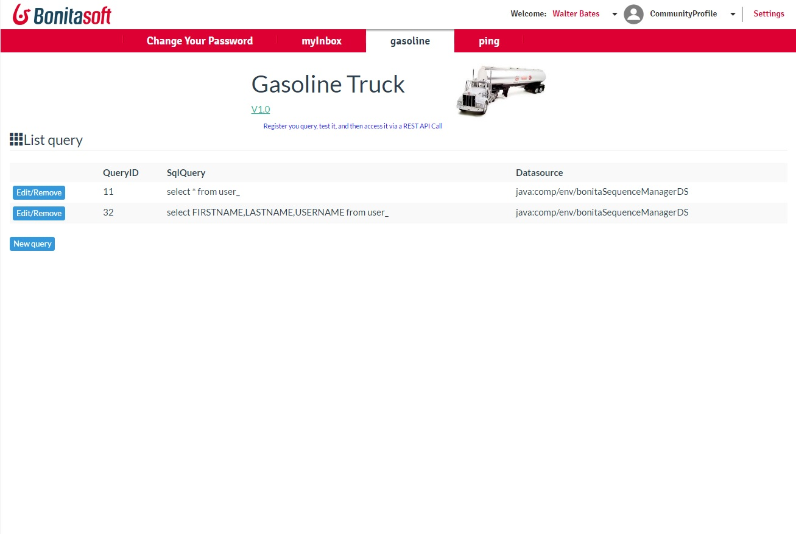
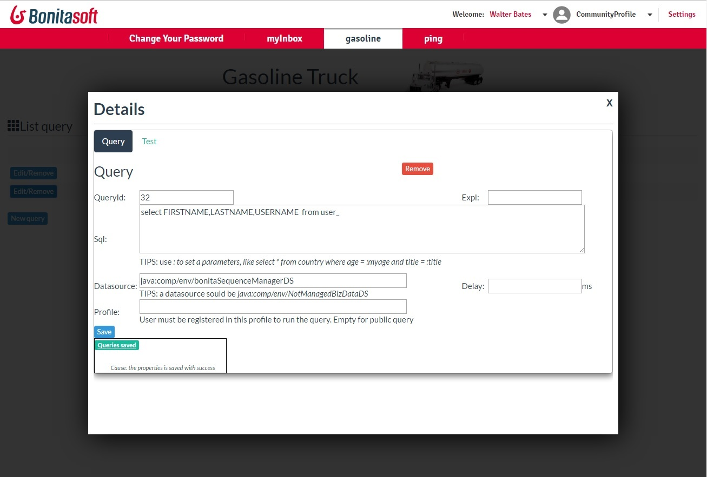
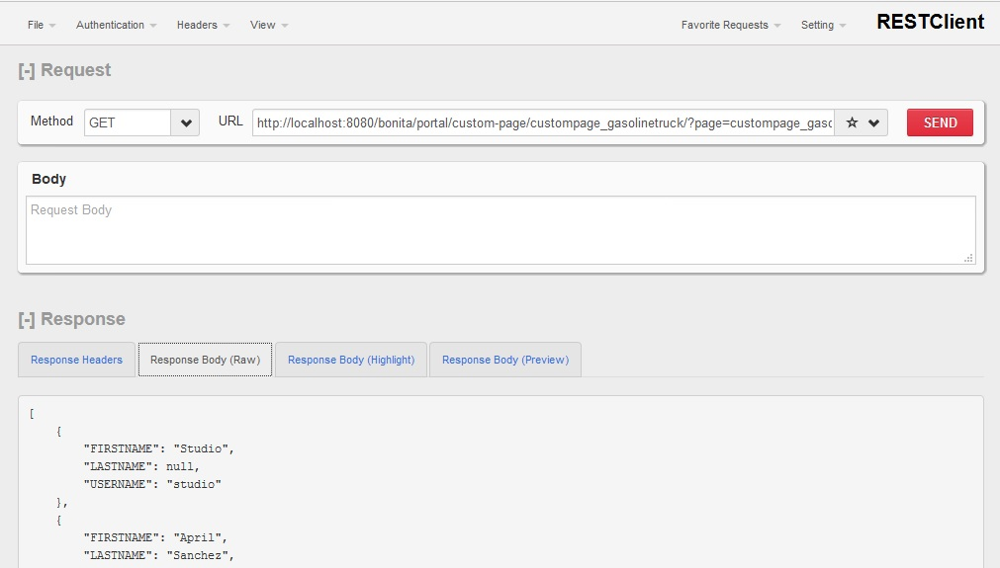

# page_gasolinetruck

Via this page, you can display easily data coming directly from a database into a Bonita BPM Forms.
The JDBC Datasource is use to have the benefit of the connection pooling.  
 
The Gasoline truck do the same as the DATA SOURCE REST API EXTENSION, plus :
* as a administrative tool to define the query
* can test and see the result of the query, to verify what you have
* can manage multiple datasource
* manage security per request (and not in general)
* base the security on the profile (and not the Permission), to have a better and power control
 
 List the different queries

For each query, define an ID, a SQL request, an explanation, a datasource.
A Delay can be include in the request, to verify how your form will handle a slow query.

Query can contains parameters : just reference it using the format " :<parametername>" like
select username from user_ where country = :countrycode

Then, give the parameters value in the REST CALL:
queryid=12&countrycode=FR

For more resources and support visit www.trycore.co
